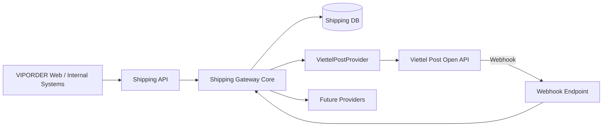

# Architecture



## Nguyên tắc

1. Business core không phụ thuộc mã trạng thái riêng của provider.
2. Provider adapter chịu trách nhiệm auth, request/response mapping.
3. Webhook phải idempotent.
4. Không lưu token/secret trong source control.
5. Không sửa DB schema ở runtime.
6. Tất cả mutation quan trọng phải có audit log.
7. Retry phải phân biệt timeout với business rejection.
8. Production chỉ deploy từ commit đã được nghiệm thu.

## Shipping Core

Phân tầng (CR-SHP-001, W-SHP-01):

```
API / Application          app/api, app/services, app/webhooks
        ↓
Shipping Core              app/domain/models
        ↓
ShippingProvider contract  app/providers/base  (provider.py + dto.py)
        ↓
Provider adapters          app/providers/<provider>/  (Viettel Post, sau này SuperShip, GHN, GHTK, VIPORDER Fleet)
```

### Nguyên tắc của lõi

- **Provider-specific status không đi xuyên vào business core.** Adapter dịch mã trạng thái của nhà vận chuyển sang `ShipmentStatus` trước khi trả về. Lõi chỉ giữ mã gốc dưới dạng chuỗi mờ `provider_status` để đối chiếu và kiểm toán, không bao giờ rẽ nhánh theo nó.
- **Provider-specific API contract nằm trong adapter.** URL, endpoint, token, chữ ký webhook, định dạng payload và bảng ánh xạ mã trạng thái đều thuộc adapter.
- Lõi không import adapter, HTTP client, ORM hay framework web. Hai bài thử `tests/unit/test_shipping_contract.py::test_core_does_not_import_provider_adapters_or_infrastructure` và `::test_core_has_no_urls_or_carrier_specific_config` giữ luật này.
- Lõi không phụ thuộc cách lưu CSDL và không tạo/sửa schema lúc chạy.

### Mô hình miền (`app/domain/models`)

| Kiểu | Vai trò |
|---|---|
| `ShippingProviderCode` | `VIETTEL_POST`, `SUPERSHIP`, `GHN`, `GHTK`, `VIPORDER_FLEET`. Khai báo mã không có nghĩa là đã có adapter |
| `ShipmentStatus` | 12 trạng thái chuẩn: `DRAFT`, `READY_TO_CREATE`, `CREATED`, `READY_TO_PICK`, `PICKED`, `IN_TRANSIT`, `OUT_FOR_DELIVERY`, `DELIVERED`, `DELIVERY_FAILED`, `RETURNING`, `RETURNED`, `CANCELLED` |
| `ShipmentPackage` | Một kiện: `weight_grams` > 0, kích thước cm > 0, đều là số nguyên kiểu strict (không nhận float, bool, chuỗi số). Không đặt trần: giới hạn khác nhau theo nhà vận chuyển, adapter tự từ chối |
| `ShipmentEvent` | Một lần quan sát trạng thái, đã ánh xạ sang trạng thái chuẩn. `occurred_at` bắt buộc có múi giờ |
| `Shipment` | Thực thể vận đơn cho một đơn VIPORDER qua một nhà vận chuyển. `apply_event()` ghi sự kiện và chuyển trạng thái; từ chối sự kiện sai nhà vận chuyển hoặc sai mã vận đơn |
| `Money` | `Decimal` ≥ 0, mã tiền tệ 3 chữ in hoa (mặc định `VND`). Không nhận float |
| `Address` | Người gửi/nhận: tên, điện thoại, địa chỉ, tỉnh bắt buộc; phường/quận tuỳ chọn |

Mọi mô hình từ chối trường lạ (`extra="forbid"`) và serialize/deserialize bằng Pydantic v2 (`model_dump(mode="json")`, `model_validate_json`).

### Hợp đồng nhà vận chuyển (`app/providers/base`)

`ShippingProvider` có 7 phương thức async trừu tượng, vào/ra bằng DTO có kiểu trong `dto.py`:

| Phương thức | Vào | Ra |
|---|---|---|
| `authenticate()` | — | `AuthResult`: không chứa token; credential ở lại trong adapter |
| `get_services(query)` | `ServiceQuery` | `list[ServiceOption]`: `service_code` là chuỗi mờ với lõi |
| `calculate_fee(request)` | `FeeRequest` | `FeeQuote` |
| `create_shipment(request)` | `CreateShipmentRequest`: ≥ 1 kiện, `order_id` không rỗng, có `idempotency_key` | `CreateShipmentResult` |
| `get_shipment(tracking_number)` | `str` | `ShipmentSnapshot` |
| `cancel_shipment(tracking_number)` | `str` | `CancelShipmentResult` |
| `handle_webhook(request)` | `WebhookRequest` (headers + payload; adapter tự kiểm chữ ký) | `WebhookResult` (danh sách `ShipmentEvent`) |

Lớp con khai báo `code` nằm ngoài `ShippingProviderCode` thì bị từ chối ngay lúc định nghĩa lớp.

### Chưa làm (việc sau)

- **Chưa kiểm luật chuyển trạng thái**: trạng thái chuẩn nào cũng có thể theo sau trạng thái nào. Bảng chuyển trạng thái cần nghiệp vụ duyệt trước khi viết.
- `ViettelPostProvider` hiện vẫn dùng chữ ký `dict` cũ. Ở thời điểm chạy nó vẫn thoả hợp đồng (đủ 7 phương thức), nhưng về kiểu thì lệch; worker phụ trách adapter sẽ chuyển sang DTO.
