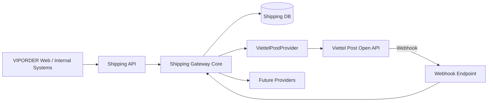

# Architecture

## Nguyên tắc

1. Business core không phụ thuộc mã trạng thái riêng của provider.
2. Provider adapter chịu trách nhiệm auth, request/response mapping.
3. Webhook phải idempotent.
4. Không lưu token/secret trong source control.
5. Không sửa DB schema ở runtime.
6. Tất cả mutation quan trọng phải có audit log.
7. Retry phải phân biệt timeout với business rejection.
8. Production chỉ deploy từ commit đã được nghiệm thu.
